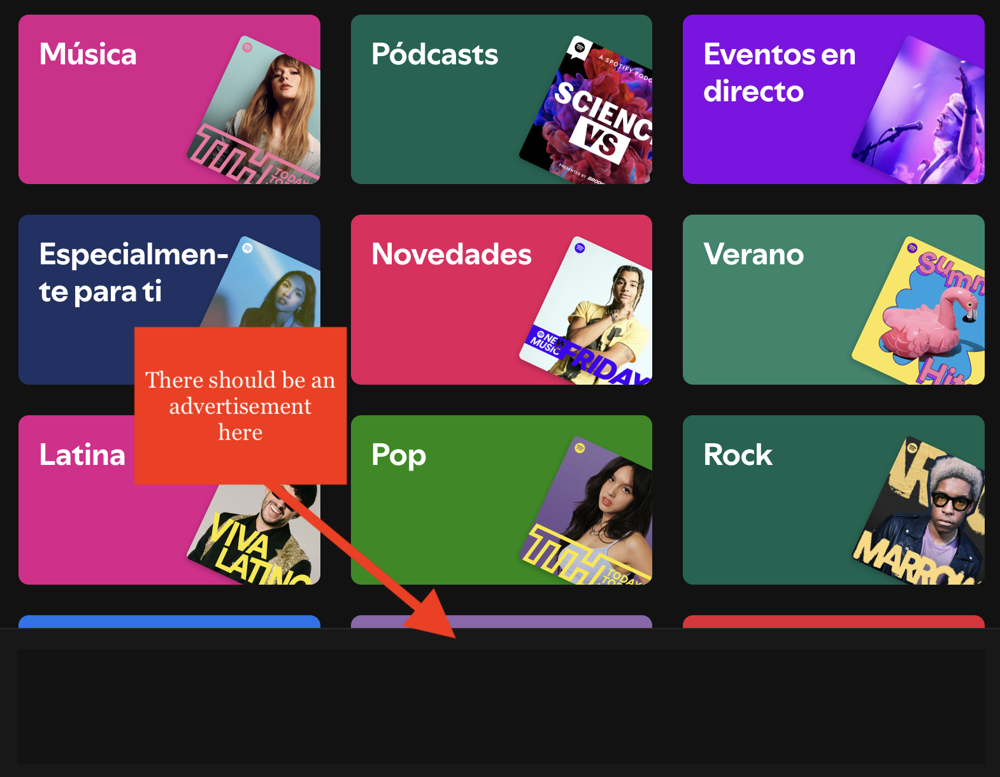

# Frequently Asked Questions

Here you can find some frequently asked questions and answers about our blocklist.

## Why do black spaces continue to appear where the advertisements were before?

!!! question inline end "Answer"
    Although our blockoblocklist blocks banner and image ads, Spotify's apps continue to reserve a space to place these ads, and since Spotify can't get those ads and banners, they will continue to appear in black.

## Why do I sometimes get a message "This content cannot be played at this time?

!!! question inline end "Answer"
    When Spotify tries to display an ad, it changes the name of the song to Advertisement, and attempts to load the audio and images from the ad. However, since it is unable to get this content through the blocklist, Spotify will resume playing music as normal.

## Why does Spotify sometimes take longer to load or behave strangely?

!!! question inline end "Answer"
    Although this list is safe and cannot damage your Spotify or your computer in any way. Sometimes Spotify may take a little bit longer to load or have some weird behavior, because the application is actually trying to continuously contact some ad domains, tracking, which are usually constantly changing to find unblocked domains. And this can sometimes change the behavior of the application a little bit.