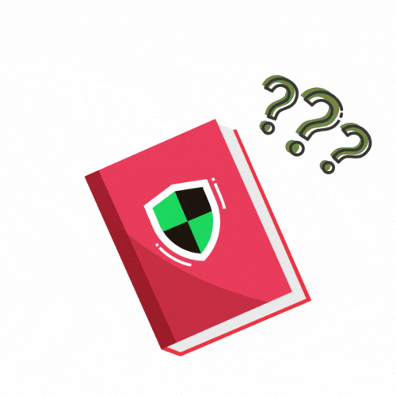

# Spotify Ads List Tutorial

<a href="https://spotify.piscinadeentropia.es/docs_interactive_install" style="text-decoration: none; display: block;">

<!-- Logo de Spotify -->

<svg viewBox="0 0 167.5 167.5" width="60" height="60" fill="white" xmlns="http://www.w3.org/2000/svg">
<path d="M83.7 0C37.5 0 0 37.5 0 83.7c0 46.3 37.5 83.7 83.7 83.7 46.3 0 83.7-37.5 83.7-83.7S130 0 83.7 0zm38.4 120.7c-1.5 2.5-4.8 3.3-7.3 1.8-15.8-9.7-35.6-11.8-59-6.5-2.8.6-5.7-1.1-6.3-4-.6-2.8 1.1-5.7 4-6.3 25.6-5.8 47.5-3.3 65.2 7.5 2.4 1.5 3.2 4.8 1.4 7.5zm10.2-22.8c-1.9 3-5.8 4-8.8 2.1-18.1-11.1-45.6-14.3-66.9-7.8-3.4 1-7-1-8-4.4s1-7 4.4-8c24.4-7.4 54.8-3.8 75.3 8.8 3.1 1.9 4 5.8 2 9.3zm.9-23.8C108.9 59 69.3 57.7 46.1 64.7c-3.7 1.1-7.7-1-8.8-4.7-1.1-3.7 1-7.7 4.7-8.8 26.7-8.1 70.3-6.6 98.6 10.2 3.3 2 4.4 6.3 2.4 9.6-1.9 3.3-6.2 4.4-9.5 2.4z"/>
</svg>

<!-- Texto -->

Installation wizard

Click here to start →

</a>

Spotify Ads List is quick and easy to install, all you need is a compatible adblocker, an internet connection and the Spotify website or app.

To install Spotify Ads List you can follow this steps:

## 1. Check compatibility

Spotify Ads List is compatible with all major ad blockers, both open-source and paid.

The currently supported adblockers are:

* Standard (Compatible with multiple adblockers and can also be used with the hosts file.)
* [Pi-Hole](https://pi-hole.net)
* [Dnsmasq](https://dnsmasq.org/doc.html)
* [Adguard](https://adguard.com/es/welcome.html)
* [uBlock Origin](https://ublockorigin.com)
* [AdBlock Plus](https://adblockplus.org)
* [DNSNet](https://github.com/t895/DNSNet)

!!! tip
    Being a simple and very backward compatible list, if your adblocker is not included above, you can ask us to include it and if necessary to generate a custom list layout for it.

## 2. Find the right list format

Spotify Ads List is available in diferents formats to make it compatible with all the adblockers listed in the step 1. 

Here is a table to find the right format for your adblcoker:

| Adblocker | List Format |
| -- | -- |
| Pi-Hole | Pi-hole	|
| Dnsmasq | Dnsmasq |
| Adguard | Adguard |
| uBlock Origin | Adguard |
| Standard (with hosts file or adblockers that supports 0.0.0.0 entry) | Standard |
| AdBlockPlus (ABP) | ABP |
| DNSNet | Standard |

!!! tip
    Being a simple and very backward compatible list, if your adblocker is not included above, you can ask us to include it and if necessary to generate a custom list layout for it.

## 3. (Optional) Setup your adblocker & Spotify

If you have not yet installed and started using your adblocker, I recommend that you do so first and, if possible, learn the basics of how it works. This will help you when installing Spotify Ads List.

Also, you must have installed Spotify (in case you are going to use it as an application) and created a Spotify account to use it, as Spotify Ads List does not perform these actions.

### Setup your adblocker

Below, you can find a series of basic guides on how to install and use your adblocker:

* Standard (Compatible with multiple adblockers and can also be used with the hosts file.)
* [Pi-Hole](https://docs.pi-hole.net/main/basic-install/)
* [Dnsmasq](https://dnsmasq.org/doc.html)
* [Adguard](https://adguard.com/kb/general/how-to-install/)
* [uBlock Origin](https://github.com/gorhill/uBlock?tab=readme-ov-file#installation)
* [AdBlockPlus (ABP)](https://help.adblockplus.org/hc/en-us/articles/1500002320801-How-to-download-and-install-Adblock-Plus)
* [DNSNet](https://github.com/t895/DNSNet)

### Setup Spotify

To start using Spotify you can use the web app or download the app for your OS:

* [Spotify Web App](https://open.spotify.com)
* [Download Spotify](https://www.spotify.com/en/download/)

## 4. Add Spotify Ads List to your adblocker

To add Spotify Ads List to your adblocker you will need to make use of a raw file that will be synced directly from our GitHub repository. To do this, simply copy the link and enter it in the appropriate field to add it to your adblocker (Or use the link in the case of browser adblockers):

# Standard adblockers

| Adblocker | Raw URL | ADS+Spotify Raw URL |
| -- | -- | -- |
| Standard | https://raw.githubusercontent.com/Isaaker/Spotify-AdsList/main/Lists/standard_list.txt | https://raw.githubusercontent.com/Isaaker/Spotify-AdsList/main/Lists/standard_list-mixed.txt |
| Pi-hole | https://raw.githubusercontent.com/Isaaker/Spotify-AdsList/main/Lists/pi-hole.txt | https://raw.githubusercontent.com/Isaaker/Spotify-AdsList/main/Lists/pi-hole-mixed.txt |
| Dnsmasq | https://raw.githubusercontent.com/Isaaker/Spotify-AdsList/main/Lists/dnsmasq.txt | https://raw.githubusercontent.com/Isaaker/Spotify-AdsList/main/Lists/dnsmasq-mixed.txt |
| Adguard | https://raw.githubusercontent.com/Isaaker/Spotify-AdsList/main/Lists/adguard.txt | https://raw.githubusercontent.com/Isaaker/Spotify-AdsList/main/Lists/abp-mixed.txt |

!!! question "How can I do this?"
    You can find more help about how to add this on this links:

    | Adblocker | Link |
    |--|--|
    | Standard | Not applicable, unless you want to use the hosts file. In that case, [read this](https://nordvpn.com/es/blog/use-hosts-file-block-ads-malware/) |
    | Pi-hole | Not official documentation for this, go to the Web UI, in the left bar click on "Adlists", enter the raw url and click "Add" |
    | Dnsmasq | There is not much official documentation, perhaps [this will help](https://dnsmasq.org/docs/dnsmasq-man.html) |
    | Adguard | [Read this](https://adguard.com/kb/) |

!!! question "What is the difference between RAW URL and ADS+Spotify Raw URL?"
    The first is designed solely to block Spotify adverts, while the second combines our block list with a generic one to enhance the blocking experience.

### Browser adblockers

#### uBlock Origin

| Browser | Add from link |
| -- | -- |
| Firefox | moz-extension://c396fed9-d8f8-4a6c-95a0-80773fa36d8a/asset-viewer.html?url=https%3A%2F%2Fraw.githubusercontent.com%2Fisaaker%2FSpotify-AdsList%2Fmain%2FLists%2Fadguard.txt&title=Spotify-AdsList&subscribe=1 |
| Chrome / Chromium | chrome-extension://cjpalhdlnbpafiamejdnhcphjbkeiagm/asset-viewer.html?url=https%3A%2F%2Fraw.githubusercontent.com%2Fisaaker%2FSpotify-AdsList%2Fmain%2FLists%2Fadguard.txt&title=Spotify-AdsList&subscribe=1 |

!!! tip
    [You can also make this manually with the adguard raw URL](https://github.com/gorhill/uBlock/wiki/Dashboard:-Filter-lists#3rd-party-filter-lists)

#### AdBlock Plus (ABP)

[You can add the blocklist to ABP with this link](https://subscribe.adblockplus.org/?location=https%3A%2F%2Fraw.githubusercontent.com%2FIsaaker%2FSpotify-AdsList%2Fmain%2FLists%2Fabp.txt&title=SpotifyAdsList)

!!! tip
    [You can also make this manually with the ABP raw URL](https://help.adblockplus.org/hc/en-us/articles/360062859913-Add-or-remove-a-custom-filter)

## 5. Add Spotify Ads List whitelist to your adblocker

To add the whitelist to your adblocker, you have to enter the whitelist domains manually in the whitelist area. You can found the whitelist on this [link](./docs_whitelist.md)

!!! question "How can I do this?"
    You can find more help about how to add this on this links:

    | Adblocker | Link |
    |--|--|
    | Standard | This is not possible in the hosts file, for other methods please consult your adblocker documentation |
    | Pi-hole | [Read this](https://discourse.pi-hole.net/t/how-do-i-whitelist-or-blacklist-a-domain/244), you can also make this form the Web UI > Domains |
    | Dnsmasq | Not docs of this available |
    | Adguard | [Read this](https://github.com/AdguardTeam/AdGuardHome/discussions/3771) |
    | uBlock Origin | [Read this](https://github.com/gorhill/uBlock/wiki/How-to-whitelist-a-web-site/745c6f01e1f88db8184bb27f48bbdd8a21b48a90) |

!!! info
    A whitelist is a list that lets your adblocker know which domains should not be blocked. Although usually these domains are not added to the list directly, many times some domains that are on the list (blocked) redirect legitimate requests to these domains (not blocked) via a CNAME and these requests are blocked before being redirected because it is a blocked domain. Therefore, the list will help you to ensure that legitimate requests can continue their course correctly.

## 6. What can I do now?

Now the installation of the list should be complete, but you can still do more things:

* [Support my work by giving a star to my repository and/or creating a fork on GitHub](https://github.com/Isaaker/Spotify-AdsList)
* [Continue reading the documentation](spotify.piscinadeentropia.es)
* [Report false positives or contribute in our repository](https://github.com/Isaaker/Spotify-AdsList/issues)
* [Add more adlists](./why_add_more_blocklists)
